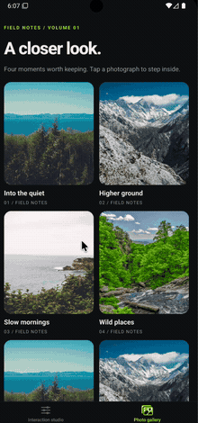
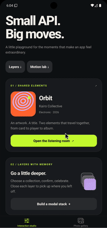

# React Native Epic Modal

A **flexible**, **lightweight**, and **powerful** modal manager for React Native apps.  
Supports **stacking**, **custom animations**, **gesture dismissals**, and **portal-based** rendering — designed for smooth and modern mobile UX.

---

## Epic Studio example

Explore shared-element transitions from an album card through two modal screens, a three-layer collection flow, and a Motion Lab with configurable entrance/exit animations, timing, gestures, and progress-driven artwork.

See the [example walkthrough and native launch instructions](example/README.md).

---

## ✨ Features

- 🎯 Portal-based rendering (modals independent of navigation tree)
- 🎯 Swipe-to-dismiss gestures with configurable areas
- 🎯 Built-in animations: `fade`, `zoom`, `slideLeft`, `slideRight`, `slideTop`, and `slideBottom`
- 🎯 Priority stacking for layered modals
- 🎯 Shared-element transitions for images and text
- 🎯 Full control via `ref.present()` and `ref.dismiss()`
- 🎯 TypeScript support out of the box
- 🎯 Lightweight and mobile-first

---

## 🎥 Demo

<p align="center">
  
  
</p>

## 📦 Installation

```bash
npm install react-native-epic-modal react-native-gesture-handler react-native-reanimated react-native-screens react-native-worklets
```

or

```bash
yarn add react-native-epic-modal react-native-gesture-handler react-native-reanimated react-native-screens react-native-worklets
```

> **Note:**  
> Make sure `react-native-reanimated` is configured correctly with the Babel plugin:  
> See [Reanimated installation guide](https://docs.swmansion.com/react-native-reanimated/docs/fundamentals/installation/).

---

## 🚀 Basic Usage

### 1. Wrap your app with `ModalProvider`

```tsx
import { ModalProvider } from 'react-native-epic-modal';

export default function App() {
  return (
    <ThemeProvider>
      <QueryClientProvider client={queryClient}>
        <ModalProvider>{/* Your App Content */}</ModalProvider>
      </QueryClientProvider>
    </ThemeProvider>
  );
}
```

`ModalProvider` must be rendered inside every context provider whose value is
used by modal content. Modal content is rendered by the provider's `ModalHost`,
so it receives contexts placed above `ModalProvider`, but not contexts declared
deeper in an individual screen.

Mount exactly one `ModalProvider` in the application. The modal registry and
host are app-wide; mounting another provider throws an error instead of rendering
the same modal stack more than once.

If a context belongs only to one modal, place its provider inside the modal:

```tsx
<Modal ref={modalRef}>
  <FormProvider {...formMethods}>
    <EditProfileForm />
  </FormProvider>
</Modal>
```

---

### 2. Use `Modal` anywhere in your app

```tsx
import { Modal, type ModalRef } from 'react-native-epic-modal';
import { useRef } from 'react';
import { Button, Text } from 'react-native';

export default function Screen() {
  const modalRef = useRef<ModalRef>(null);

  return (
    <>
      <Button title="Open Modal" onPress={() => modalRef.current?.present()} />

      <Modal
        ref={modalRef}
        animation={{ entering: 'zoom', exiting: 'zoom', duration: 250 }}
      >
        <Text>Modal Content Here!</Text>
      </Modal>
    </>
  );
}
```

---

## ⚙️ Modal Props

| Prop               | Type                   | Default                                                | Description                                |
| :----------------- | :--------------------- | :----------------------------------------------------- | :----------------------------------------- |
| `animation`        | `ModalAnimationConfig` | `{ entering: 'fade', exiting: 'fade', duration: 250 }` | Configure entering and exiting presets     |
| `gestureConfig`    | `ModalGestureConfig`   | —                                                      | Configure swipe dismissal and active edges |
| `style`            | `StyleProp<ViewStyle>` | —                                                      | Style the modal content container          |
| `backdropStyle`    | `StyleProp<ViewStyle>` | —                                                      | Style the backdrop                         |
| `animationEnabled` | `boolean`              | `true`                                                 | Enable or disable modal animations         |
| `onLayout`         | `(event) => void`      | —                                                      | Observe the modal content layout           |
| `ref.present()`    | `() => void`           | —                                                      | Present the modal                          |
| `ref.dismiss()`    | `() => void`           | —                                                      | Dismiss the modal                          |

---

## ✍️ Example Gesture Config

```tsx
gestureConfig={{
  enabled: true,
  immersive: false,
  edges: { left: 50, top: 100 },
  swipeVelocityThreshold: 800,
  swipeProgressToClose: 0.6,
  dismissBehavior: 'settle',
}}
```

`edges` defines the active start areas for edge gestures. A gesture from the
left edge dismisses to the right; right dismisses to the left; top dismisses
down; and bottom dismisses up. Set `immersive: true` to track a swipe that can
start anywhere on the modal. `dismissBehavior: 'followGesture'` keeps the
modal following the swipe while it completes.

## Animate Custom Content

Use `useModalProgress` inside a modal child to build an animation that follows the
modal presentation progress on the UI thread:

```tsx
import Animated, { useAnimatedStyle } from 'react-native-reanimated';
import { useModalProgress } from 'react-native-epic-modal';

function ModalContent() {
  const progress = useModalProgress();
  const style = useAnimatedStyle(() => ({
    transform: [{ translateY: (1 - progress.value) * 24 }],
    opacity: progress.value,
  }));

  return <Animated.View style={style}>{/* content */}</Animated.View>;
}
```

`useModalProgress` must be called from a component rendered inside `Modal`.

## Shared-element transitions

`ModalProvider` mounts the shared-element provider and host for the application.
Use `SharedElement` for visual content such as images and `SharedText` for text.
Both endpoints must be mounted in the same `ModalProvider`-managed tree.

```tsx
import { Image } from 'react-native';
import {
  Geometry,
  Projection,
  SharedElement,
  SharedElementModal,
  SharedText,
  mix,
} from 'react-native-epic-modal';

<SharedElement id="home-art">
  <Image source={artwork} style={{ width: 120, height: 120 }} />
</SharedElement>
<SharedText id="home-title" style={styles.title}>
  Orbit
</SharedText>

<SharedElementModal
  ref={modalRef}
  transitions={[
    {
      key: 'art',
      startId: 'home-art',
      endId: 'player-art',
      transition: mix(Geometry.resize, Projection.linear),
    },
    {
      key: 'title',
      startId: 'home-title',
      endId: 'player-title',
      transition: mix(Geometry.zoom, Projection.linear),
    },
  ]}
>
  <SharedElement id="player-art">
    <Image source={artwork} style={{ width: 320, height: 420 }} />
  </SharedElement>
  <SharedText id="player-title" style={styles.largeTitle}>
    Orbit
  </SharedText>
</SharedElementModal>;
```

`SharedText` is a text-aware shared element. It uses `onTextLayout` to measure
the widest rendered line and text height, so it should be used directly instead
of wrapping a `Text` component in `SharedElement`.

`SharedElementModal` adds these props to the regular modal API:

- `transitions`: transition descriptors with `key`, `startId`, `endId`, and an
  optional `transition`, `element`, or `clip` override.
- `measurementTimeout`: maximum initial layout wait in milliseconds; defaults to
  `1000`.
- `onMeasurementTimeout`: callback receiving the IDs that did not settle in time.

Use `transition` when a transition needs a custom path. The callback runs as a
Reanimated worklet and receives normalized progress plus the measured start and
end rectangles:

```tsx
const spiral = ({ progress, start, end }) => {
  'worklet';

  const angle = progress * Math.PI * 2;
  const radius = 40 * (1 - progress);
  const x = start.x + (end.x - start.x) * progress;
  const y = start.y + (end.y - start.y) * progress;

  return {
    left: x + Math.cos(angle) * radius,
    top: y + Math.sin(angle) * radius,
    transform: [{ rotate: `${angle}rad` }],
  };
};

<SharedElementModal
  transitions={[
    {
      key: 'art',
      startId: 'home-art',
      endId: 'player-art',
      transition: spiral,
    },
  ]}
/>;
```

Available geometry presets are `resize`, `zoom`, `aspectResizeWidth`, and
`aspectResizeHeight`. Available projection presets are `linear`, `spiral`,
`slingshot`, `arc`, `swoosh`, and `portalWarp`.

`element` is optional; when omitted, the transition uses the source endpoint's
rendered element. Set `clip={false}` when the transition should be allowed to
draw outside its animated bounds.

`SharedElementModal.present()` mounts the destination invisibly and calls
`waitForStableRects` before starting the animation. Every configured `startId`
and `endId` must be mounted and report finite coordinates with positive dimensions.
Measurements must remain unchanged for two animation frames; dismissing the
modal cancels the pending wait. If an endpoint does not become ready within
`measurementTimeout` (1000 ms by default), the modal opens without the shared
transition. Use `onMeasurementTimeout` to report the affected element IDs.

---

## 🛠 Requirements

- React Native >= 0.71
- react-native-gesture-handler >= 2.0
- react-native-reanimated >= 3.16
- react-native-screens >= 3.0
- react-native-worklets >= 0.5

✅ Compatible with Expo, Bare React Native, and monorepo setups.

---

## 🤝 Contributing

We welcome contributions!  
Please read our [Contributing Guide](CONTRIBUTING.md) to learn how to help improve Epic Modal.

---

## 📄 License

MIT License © 2024 [Oleg Mazur](https://github.com/mazurGit)

---

> Built with ❤️ using [create-react-native-library](https://github.com/callstack/react-native-builder-bob)
